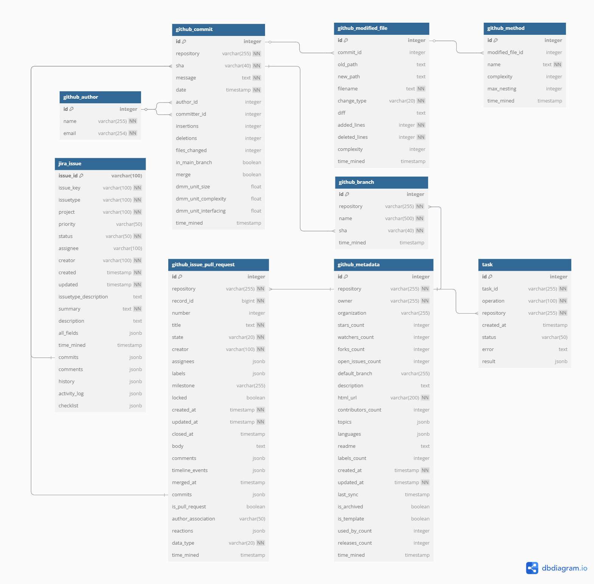

# RAISE API Backend Documentation

This directory contains the Django-based RAISE API backend that provides comprehensive data mining capabilities for GitHub repositories and Jira projects.

## 📖 API Reference and Usage Instructions

The RAISE API provides comprehensive endpoints for mining and querying data from GitHub repositories and Jira projects. All endpoints return JSON responses and support pagination.

### GitHub Data Mining Endpoints

#### 1. Commit Collection (`POST /api/github/commits/collect/`)

**Purpose**: Collect commits from a GitHub repository with optional date filtering.

**Parameters**:
- `repo_name` (required): Repository in format `owner/repo`
- `start_date` (optional): Start date in ISO 8601 format
- `end_date` (optional): End date in ISO 8601 format
- `commit_sha` (optional): Specific commit SHA to fetch

**Example**:
```bash
curl -X POST "http://localhost:8000/api/github/commits/collect/" \
     -H "Content-Type: application/json" \
     -d '{
       "repo_name": "octocat/Hello-World",
       "start_date": "2023-01-01T00:00:00Z",
       "end_date": "2023-06-30T23:59:59Z"
     }'
```

**Response**:
```json
{
  "task_id": "abc123-def456-ghi789",
  "message": "Task successfully initiated",
  "status_endpoint": "http://localhost:8000/api/jobs/tasks/abc123-def456-ghi789/"
}
```

#### 2. Issue Collection (`POST /api/github/issues/collect/`)

**Purpose**: Collect issues and pull requests from a GitHub repository.

**Parameters**:
- `repo_name` (required): Repository in format `owner/repo`
- `start_date` (optional): Start date in ISO 8601 format
- `end_date` (optional): End date in ISO 8601 format
- `depth` (optional): "basic" or "complex" (default: "basic")

**Example**:
```bash
curl -X POST "http://localhost:8000/api/github/issues/collect/" \
     -H "Content-Type: application/json" \
     -d '{
       "repo_name": "octocat/Hello-World",
       "start_date": "2023-01-01T00:00:00Z",
       "end_date": "2023-06-30T23:59:59Z",
       "depth": "basic"
     }'
```

#### 3. Pull Request Collection (`POST /api/github/pull-requests/collect/`)

**Purpose**: Collect pull requests from a GitHub repository.

**Parameters**:
- `repo_name` (required): Repository in format `owner/repo`
- `start_date` (optional): Start date in ISO 8601 format
- `end_date` (optional): End date in ISO 8601 format
- `depth` (optional): "basic" or "complex" (default: "basic")

**Example**:
```bash
curl -X POST "http://localhost:8000/api/github/pull-requests/collect/" \
     -H "Content-Type: application/json" \
     -d '{
       "repo_name": "octocat/Hello-World",
       "start_date": "2023-01-01T00:00:00Z",
       "end_date": "2023-06-30T23:59:59Z",
       "depth": "basic"
     }'
```

#### 4. Branch Collection (`POST /api/github/branches/collect/`)

**Purpose**: Collect branch information from a GitHub repository.

**Parameters**:
- `repo_name` (required): Repository in format `owner/repo`

**Example**:
```bash
curl -X POST "http://localhost:8000/api/github/branches/collect/" \
     -H "Content-Type: application/json" \
     -d '{
       "repo_name": "octocat/Hello-World"
     }'
```

#### 5. Metadata Collection (`POST /api/github/metadata/collect/`)

**Purpose**: Collect repository metadata (stars, forks, languages, etc.).

**Parameters**:
- `repo_name` (required): Repository in format `owner/repo`

**Example**:
```bash
curl -X POST "http://localhost:8000/api/github/metadata/collect/" \
     -H "Content-Type: application/json" \
     -d '{
       "repo_name": "octocat/Hello-World"
     }'
```

#### 6. Bulk Collection (`POST /api/github/collect-all/`)

**Purpose**: Collect multiple data types from multiple repositories in a single request.

**Parameters**:
- `repositories` (required): Array of repository names
- `collect_types` (required): Array of data types to collect
- `start_date` (optional): Start date in ISO 8601 format
- `end_date` (optional): End date in ISO 8601 format
- `depth` (optional): "basic" or "complex" (default: "basic")

**Example**:
```bash
curl -X POST "http://localhost:8000/api/github/collect-all/" \
     -H "Content-Type: application/json" \
     -d '{
       "repositories": ["octocat/Hello-World", "facebook/react"],
       "collect_types": ["commits", "issues", "pull_requests", "metadata"],
       "start_date": "2023-01-01T00:00:00Z",
       "end_date": "2023-06-30T23:59:59Z"
     }'
```

### GitHub Data Query Endpoints

#### 1. Query Commits (`GET /api/github/commits/`)

**Purpose**: Retrieve collected commits with filtering and pagination.

**Query Parameters**:
- `repository`: Filter by repository name
- `created_after`: Filter by creation date (ISO 8601)
- `created_before`: Filter by creation date (ISO 8601)
- `message`: Search in commit messages
- `author_name`: Filter by author name
- `sha`: Filter by specific commit SHA

**Example**:
```bash
curl "http://localhost:8000/api/github/commits/?repository=octocat/Hello-World&created_after=2023-01-01"
```

#### 2. Query Issues (`GET /api/github/issues/`)

**Purpose**: Retrieve collected issues with filtering and pagination.

**Query Parameters**:
- `repository`: Filter by repository name
- `created_after`: Filter by creation date
- `created_before`: Filter by creation date
- `updated_after`: Filter by update date
- `updated_before`: Filter by update date
- `title`: Search in issue titles
- `creator`: Filter by creator
- `state`: Filter by state (open, closed)
- `has_label`: Filter by label

**Example**:
```bash
curl "http://localhost:8000/api/github/issues/?repository=octocat/Hello-World&state=open"
```

#### 3. Query Pull Requests (`GET /api/github/pull-requests/`)

**Purpose**: Retrieve collected pull requests with filtering and pagination.

**Query Parameters**: Same as issues endpoint

**Example**:
```bash
curl "http://localhost:8000/api/github/pull-requests/?repository=octocat/Hello-World&state=merged"
```

#### 4. Query Branches (`GET /api/github/branches/`)

**Purpose**: Retrieve collected branch information.

**Query Parameters**:
- `repository`: Filter by repository name
- `name`: Filter by branch name

**Example**:
```bash
curl "http://localhost:8000/api/github/branches/?repository=octocat/Hello-World"
```

#### 5. Query Metadata (`GET /api/github/metadata/`)

**Purpose**: Retrieve repository metadata.

**Query Parameters**:
- `repository`: Filter by repository name

**Example**:
```bash
curl "http://localhost:8000/api/github/metadata/?repository=octocat/Hello-World"
```

#### 6. Dashboard Statistics (`GET /api/github/dashboard/`)

**Purpose**: Get statistical summaries of mined data.

**Query Parameters**:
- `repository_id`: Specific repository ID for detailed stats
- `start_date`: Filter from this date
- `end_date`: Filter up to this date

**Example**:
```bash
curl "http://localhost:8000/api/github/dashboard/?start_date=2023-01-01T00:00:00Z"
```

### Jira Data Mining Endpoints

#### 1. Issue Collection (`POST /api/jira/issues/collect/`)

**Purpose**: Collect issues from a Jira project.

**Parameters**:
- `jira_domain` (required): Jira domain (e.g., "company.atlassian.net")
- `project_key` (required): Project key (e.g., "PROJ")
- `issuetypes` (optional): Array of issue types to filter
- `start_date` (optional): Start date (YYYY-MM-DD format)
- `end_date` (optional): End date (YYYY-MM-DD format)

**Example**:
```bash
curl -X POST "http://localhost:8000/api/jira/issues/collect/" \
     -H "Content-Type: application/json" \
     -d '{
       "jira_domain": "ecosystem.atlassian.net",
       "project_key": "AO",
       "start_date": "2023-01-01",
       "end_date": "2023-06-30"
     }'
```

### Jira Data Query Endpoints

#### 1. Query Issues (`GET /api/jira/issues/`)

**Purpose**: Retrieve collected Jira issues with filtering.

**Query Parameters**:
- `created_after`: Filter by creation date
- `created_before`: Filter by creation date
- `updated_after`: Filter by update date
- `updated_before`: Filter by update date
- `summary`: Search in issue summaries
- `description`: Search in issue descriptions
- `creator`: Filter by creator
- `assignee`: Filter by assignee
- `status`: Filter by status
- `project`: Filter by project key
- `priority`: Filter by priority
- `issuetype`: Filter by issue type

**Example**:
```bash
curl "http://localhost:8000/api/jira/issues/?project=AO&status=Open"
```

#### 2. Jira Dashboard (`GET /api/jira/dashboard/`)

**Purpose**: Get statistical summaries of Jira data.

**Query Parameters**:
- `project_name`: Specific project for detailed stats
- `start_date`: Filter from this date
- `end_date`: Filter up to this date

**Example**:
```bash
curl "http://localhost:8000/api/jira/dashboard/?project_name=AO"
```

### Task Management Endpoints

#### 1. List All Tasks (`GET /api/jobs/`)

**Purpose**: View all mining tasks and their status.

**Example**:
```bash
curl "http://localhost:8000/api/jobs/"
```

#### 2. Check Task Status (`GET /api/jobs/tasks/{task_id}/`)

**Purpose**: Check the status of a specific mining task.

**Example**:
```bash
curl "http://localhost:8000/api/jobs/tasks/abc123-def456-ghi789/"
```

#### 3. Cancel Task (`DELETE /api/jobs/tasks/{task_id}/`)

**Purpose**: Cancel a running mining task.

**Example**:
```bash
curl -X DELETE "http://localhost:8000/api/jobs/tasks/abc123-def456-ghi789/"
```

### Data Export Endpoints

#### 1. Export Data (`POST /api/github/export/`)

**Purpose**: Export collected data in JSON format.

**Parameters**:
- `table`: Table name to export
- `ids` (optional): Array of specific IDs to export
- `format`: Export format (currently only "json")
- `data_type` (optional): For githubissuepullrequest table

**Example**:
```bash
curl -X POST "http://localhost:8000/api/github/export/" \
     -H "Content-Type: application/json" \
     -d '{
       "table": "githubcommit",
       "format": "json"
     }'
```

## 📊 Data Structure

The system stores data in PostgreSQL with the following model:

### Database Schema Diagram

A visual overview of the API's data model is available in the database schema diagram. Click on the image below to view the full diagram:

[](docs/database-diagram.png)

This diagram provides a comprehensive view of all database tables, their relationships, and the overall structure of the backend. It can help developers understand:

- Table relationships and foreign key constraints
- Data types and field specifications
- Primary keys and unique constraints
- The complete data flow between GitHub and Jira entities

Refer to this diagram when working with the API to better understand how the backend is structured and how different data entities relate to each other.

- **`github_commit`**: Commits with code metrics (insertions, deletions, complexity)
- **`github_issue_pull_request`**: Unified issues and PRs with comments and timeline
- **`github_metadata`**: Repository metadata (stars, forks, languages)
- **`jira_issue`**: Jira issues with complete history and relationships
- **`jobs_task`**: Mining task execution history

### Database Connection

Use these credentials (from your `.env` file):

```
Host: localhost
Port: 5432
Database: your_db_name
Username: your_db_username
Password: [as configured in your .env file]
```

## 🐛 Troubleshooting

### Common Issues

#### 1. Port 5432 Already in Use

**Problem**: PostgreSQL port conflict when starting containers.

**Solutions**:

**Option A: Stop existing PostgreSQL service**
```bash
# Linux/macOS
sudo lsof -ti:5432 | xargs sudo kill -9

# Windows: Open Task Manager → Processes → End "postgres.exe" tasks
```

**Option B: Use different port (if your client supports it)**
```yaml
# Edit docker-compose.yaml, change the port mapping:
ports:
  - "5433:5432"  # Use port 5433 instead of 5432
```

**Option C: Connect to existing PostgreSQL instance**
- If you have PostgreSQL already running, you can connect to it directly
- Update your `.env` file to point to your existing PostgreSQL instance
- Some database clients allow multiple connections to the same port

#### 2. Invalid or Expired API Tokens

**Problem**: Authentication errors when accessing protected endpoints.

**Symptoms**:
- HTTP 401 Unauthorized errors
- "Invalid token" messages in logs
- Rate limit errors even with valid tokens

**Solutions**:

**Check GitHub Token**:
```bash
curl -H "Authorization: token YOUR_GITHUB_TOKEN" https://api.github.com/user
```
**Expected response**: Your GitHub user information

**Check Jira Token**:
```bash
curl -H "Authorization: Bearer YOUR_JIRA_TOKEN" \
     https://YOUR_DOMAIN.atlassian.net/rest/api/3/myself
```
**Expected response**: Your Jira user information

**Regenerate Tokens**:
- GitHub: Go to [GitHub Settings > Developer Settings > Personal Access Tokens](https://github.com/settings/tokens)
- Jira: Go to [Jira API Tokens](https://id.atlassian.com/manage-profile/security/api-tokens)
- Create new tokens and update your `.env` file

#### 3. Insufficient Memory

**Problem**: Docker containers fail to start or mining tasks fail.

**Solution**:
```yaml
# Edit docker-compose.yaml, section worker:
deploy:
  resources:
    limits:
      memory: 2G  # Reduce from 4G to 2G or 1G
```

#### 4. Docker Permission Issues (Linux)

**Problem**: "Permission denied" when running Docker commands.

**Solution**:
```bash
# Add user to docker group
sudo usermod -aG docker $USER

# Logout and login again, or restart terminal
```

#### 5. Network Connectivity Issues

**Problem**: Cannot access APIs or download Docker images.

**Solutions**:
- Check internet connection
- Configure proxy if behind corporate firewall
- Try different DNS servers

### Debug Logs

```bash
# View real-time logs
docker-compose logs -f web
docker-compose logs -f worker

# View specific error logs
docker-compose logs worker | grep ERROR

# View all logs
docker-compose logs
```

### Performance Optimization

For large repositories, consider:
- Using multiple API tokens to avoid rate limits
- Mining smaller date ranges
- Increasing Docker memory limits
- Using SSD storage for better I/O performance

## 📞 Support

For API-related questions:

1. **Main Documentation**: See the main README.md for setup instructions
2. **Web Interface**: See [../web_src/README.md](../web_src/README.md) for frontend usage
